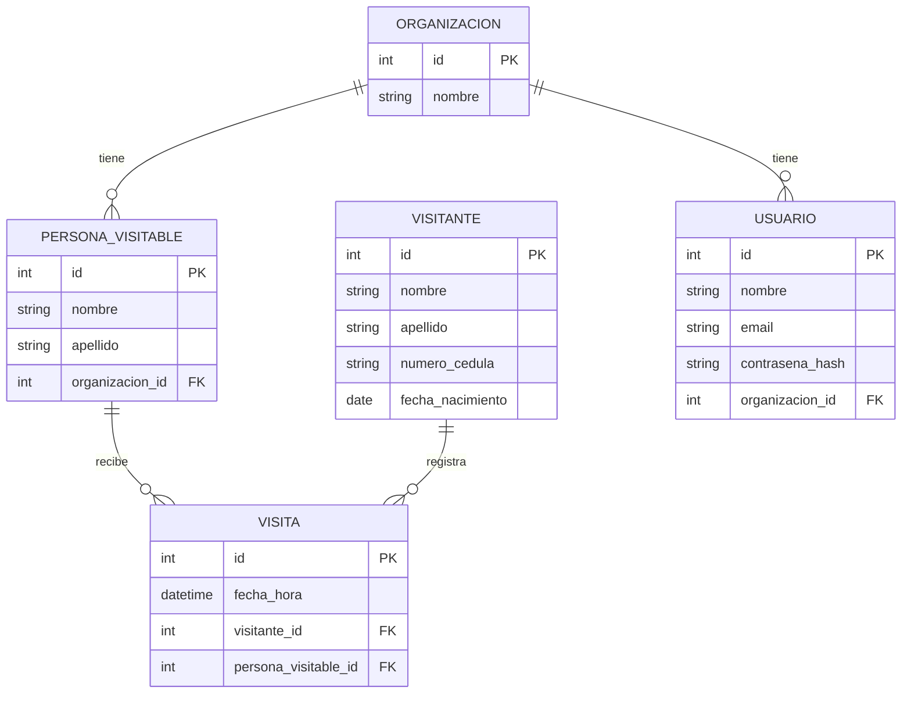

# Modelo de Dominio - Sistema de Control de Accesos

```mermaid
erDiagram
    ORGANIZACION {
        int id PK
        string nombre
    }

    VISITANTE {
        int id PK
        string nombre
        string apellido
        string numero_cedula
        date fecha_nacimiento
    }

    PERSONA_VISITABLE {
        int id PK
        string nombre
        string apellido
        int organizacion_id FK
    }

    VISITA {
        int id PK
        datetime fecha_hora
        int visitante_id FK
        int persona_visitable_id FK
    }

    USUARIO {
        int id PK
        string nombre
        string email
        string contrasena_hash
        int organizacion_id FK
    }

    ORGANIZACION ||--o{ PERSONA_VISITABLE : "tiene"
    ORGANIZACION ||--o{ USUARIO : "tiene"
    PERSONA_VISITABLE ||--o{ VISITA : "recibe"
    VISITANTE ||--o{ VISITA : "registra"
```
